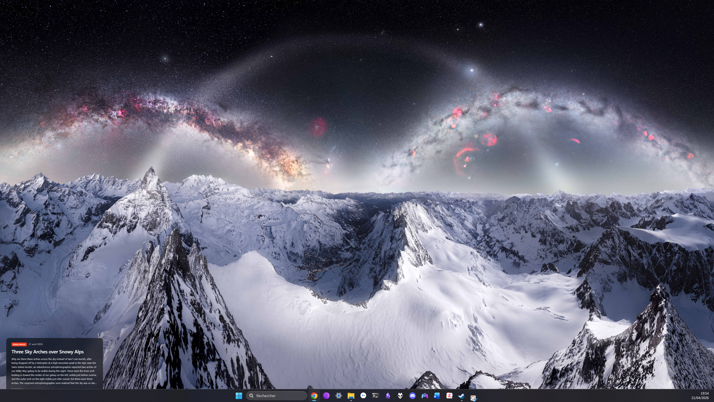
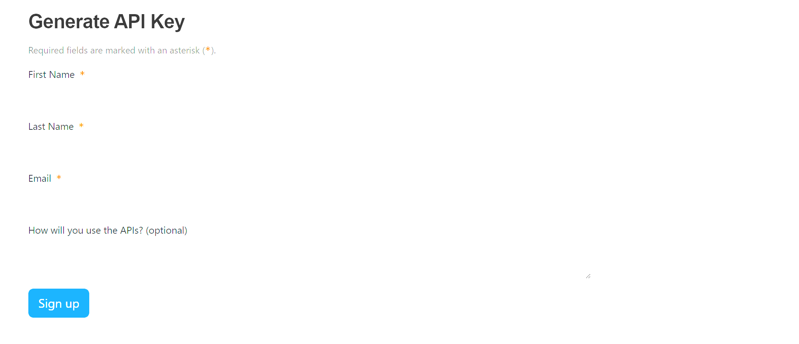
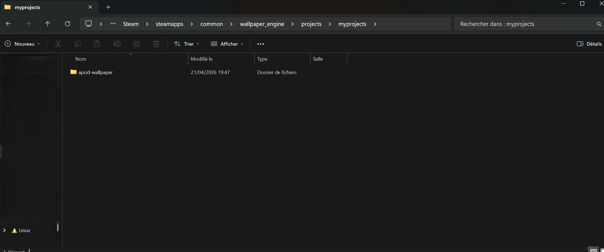
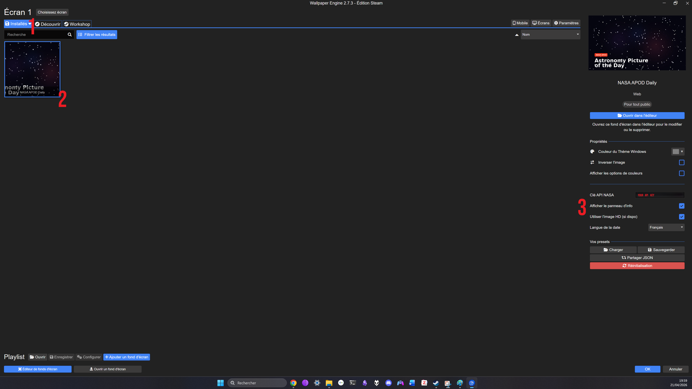

# 🌌 APOD Wallpaper Engine

**NASA's Astronomy Picture of the Day — live on your desktop, every day.**

A lightweight web wallpaper for [Wallpaper Engine](https://store.steampowered.com/app/431960/Wallpaper_Engine/) that automatically fetches and displays NASA's APOD in stunning HD, with a sleek info panel showing the title, date, explanation, and photographer credit.

---

## ✨ Features

- 🖼️ **Daily updates** — automatically fetches the latest APOD every hour
- 🎯 **HD quality** — uses `hdurl` when available for maximum resolution
- 🎨 **Elegant info panel** — title, date, explanation, and photographer credit with a subtle glassmorphism effect
- 🌍 **Multilingual dates** — French / English toggle
- 🎬 **Video fallback** — on days when APOD is a video, the thumbnail is used automatically
- ⚡ **Lightweight** — pure HTML/CSS/JS, no dependencies, ~10 KB
- 🔧 **Fully customizable** — toggle the info panel, HD mode, and date language from Wallpaper Engine settings
- 🎛️ **Movable & resizable info panel** — adjust X/Y offset and scale (×1 → ×1.75) from the Customize panel, or scroll the mouse wheel over the panel for live zoom
- 💾 **Persistent cache** — the last successful APOD is cached locally, so a NASA API outage never leaves you with a black screen

---

## 🚀 Quick Start

### 1. Get your free NASA API key *(2 minutes)*

Head over to [api.nasa.gov](https://api.nasa.gov/) and fill out the "Generate API Key" form. Your key arrives instantly by email.

> ⚠️ The default `DEMO_KEY` is shared globally and limited to **30 requests/hour** across all users on Earth. Get your own — it's free, unlimited for your use, and takes 30 seconds.

### 2. Install the wallpaper

1. Download the latest release [here](https://github.com/VendenIX/apod-wallpaper-engine/releases/) (or clone this repo)
2. In Steam, right-click **Wallpaper Engine** → **Manage** → **Browse local files**
3. Navigate to `projects/myprojects/` *(create the `myprojects` folder if it doesn't exist)*
4. Copy the entire `apod-wallpaper` folder into it
5. Restart Wallpaper Engine

The wallpaper will appear in your **Installed** tab.

### 3. Configure your API key

Select the wallpaper and open the **Customize** panel on the right. Paste your API key in the **NASA API Key** field and hit OK.

That's it — you should now see today's APOD on your desktop. 🚀

---

## ⚙️ Settings

| Option | Description | Default |
|---|---|---|
| **NASA API key** | Your personal key from [api.nasa.gov](https://api.nasa.gov/) — required | *(empty)* |
| **Show info panel** | Toggle the title/description overlay | `true` |
| **Use HD image** | Uses `hdurl` from the API when available | `true` |
| **Date language** | Locale for the date format (`en` / `fr`) | `en` |
| **Panel horizontal offset** | Shift the info panel left/right in pixels (`+` = right). Useful when a sidebar crops the default position. | `0` |
| **Panel vertical offset** | Shift the info panel up/down in pixels (`+` = up). Raise the panel above the Windows taskbar. | `0` |
| **Panel size** | Scale the info panel: `×1` / `×1.25` / `×1.5` / `×1.75`. You can also scroll the mouse wheel over the panel to cycle sizes live. | `×1` |
| **Debug mode** | Shows a small overlay with API key, last call, cache state | `false` |

---

## 🔧 How It Works

The wallpaper is a small HTML file that:

1. Calls `https://api.nasa.gov/planetary/apod?api_key=YOUR_KEY&thumbs=true` on load
2. Preloads the returned image (`hdurl` or `url`, or `thumbnail_url` for videos)
3. Displays it as a full-screen cover background with a fade-in transition
4. Renders the metadata in a glassmorphism info panel
5. Re-checks hourly for a new APOD

Wallpaper Engine's `wallpaperPropertyListener` handles live settings updates — no reload needed when you change options.

---

## 🐛 Troubleshooting

<b>Black screen / no image loading</b>

Open the editor in Wallpaper Engine, right-click the wallpaper → **Open in Editor**, then press `F12` to see console errors. Most common causes:
- Invalid API key → double-check for trailing spaces
- Firewall blocking `api.nasa.gov`
- You hit the `DEMO_KEY` rate limit — get your own key

<b>"Error: 429" or "403"</b>

Rate limit hit. If you're using `DEMO_KEY`, switch to your personal key. If you already use your own key and still hit 429, wait an hour — you've sent more than 1000 requests, which is unusual for this wallpaper.

<b>Info panel doesn't appear</b>

Check the "Show Info Panel" toggle in the Customize panel. If still missing, the API call probably failed — see console output.

<b>Today's APOD is a video and the image is weird</b>

When APOD is a YouTube/Vimeo video, the wallpaper uses the video's thumbnail. These are lower resolution than regular APODs. This is a limitation of the NASA API, not the wallpaper.

---

## 📜 Copyright & Image Rights

**Important:** NASA's APOD images are *not* all in the public domain.

While the **code in this repository** is MIT-licensed and freely reusable, the **images fetched by the API** belong to their respective creators — often independent astrophotographers who retain full copyright. The wallpaper displays the credit/copyright line directly in the info panel whenever available.

If you want to reuse an APOD image for anything beyond viewing it on your own desktop (prints, commercial use, redistribution), you must contact the original copyright owner directly. See [NASA's official rights notice](https://apod.nasa.gov/apod/lib/about_apod.html) for details.

This repository does **not** redistribute any APOD images — it only provides code that fetches them live from NASA's public API on the end user's machine.

---

## 🤝 Contributing

PRs welcome! Some ideas:
- Additional language options for the date format
- Alternative layouts for the info panel
- Click-through to open the APOD page in a browser
- Archive mode (random past APOD instead of today's)

---

## 📄 License

Code released under the [MIT License](./LICENSE). See the Copyright section above regarding the images themselves.

---

## 🙏 Credits

- **[NASA APOD](https://apod.nasa.gov/apod/)** — curated daily since 1995 by Robert Nemiroff & Jerry Bonnell
- All individual astrophotographers whose work is featured — credited in the wallpaper's info panel
- [Wallpaper Engine](https://store.steampowered.com/app/431960/Wallpaper_Engine/) by Kristjan Skutta

---

*Not affiliated with NASA or Valve. APOD is a service of ASD at NASA/GSFC & Michigan Tech.*

⭐ **If you enjoy this wallpaper, consider starring the repo!**

🤖 *Vibe-coded with [Claude Code](https://claude.com/claude-code)*

